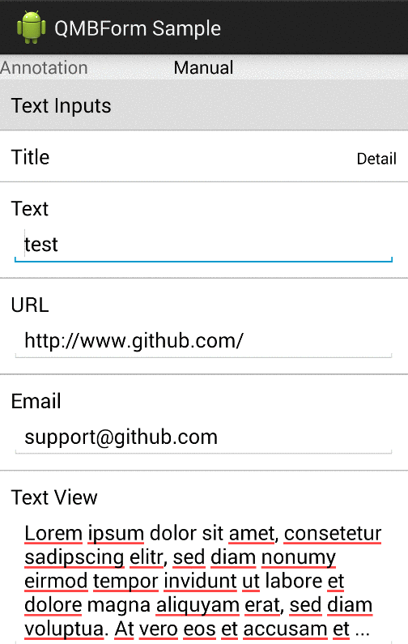

QMBForm
=======

Create simple Android forms



## Basic Usage

1.  Create a "FromDescriptor" - It's the holder for the form

    ```java
    FormDescriptor descriptor = FormDescriptor.newInstance();
    descriptor.setOnFormRowValueChangedListener(this); //Listen for changes
    ```

1.  Create sections with "SectionDescriptor" and add rows - Sections can have titles and rows (Form Elements)

    ```java
    SectionDescriptor sectionDescriptor = SectionDescriptor.newInstance("tag","Title");
    
    //Add rows - form elements
    sectionDescriptor.addRow( RowDescriptor.newInstance("text",RowDescriptor.FormRowDescriptorTypeText, "Text", new Value<String>("test")) );
    sectionDescriptor.addRow( RowDescriptor.newInstance("dateDialog",RowDescriptor.FormRowDescriptorTypeDate, "Date Dialog") );
    ```
    
1.  To render your form, use the "FormManager" helper. You will need a ListView instance.
  
    ```java
        FormManager formManager = new FormManager();
        formManager.setup(descriptor, mListView, getActivity());
        formManager.setOnFormRowClickListener(this);    
    ```


    
1.  Attention! If you use EditText based form elements, make sure you set "windowSoftInputMode" to "adjustPan"

    Do it in your manifest:
    ```xml
    <activity
			      android:windowSoftInputMode="adjustPan"/>
            
    ```

    Or programmatically in the onCreate method of your activity
    ```java
    @Override
    protected void onCreate(Bundle savedInstanceState) {

        super.onCreate(savedInstanceState);

        getWindow().setSoftInputMode(WindowManager.LayoutParams.SOFT_INPUT_ADJUST_PAN);
        
    }
    ```
    
1.  Create elements with custom type identifier and a FormCell class. You can also submit configs to use objects in your cell

    ```java
    String customType = "customRowIdentifier";
    CellViewFactory.getInstance().setRowTypeMap(customType, CustomFormCell.class);

    RowDescriptor customRow = RowDescriptor.newInstance("custom",customType, "title", new Value<String>("value"));
    HashMap<String, Object> cellConfig = new HashMap();
    cellConfig.put("config",configObject);
    customRow.setCellConfig(cellConfig);
    section.addRow(customRow);
    ```

## Use annotations for models

1.  You can create a form from a POJO by adding annotations to your model properties
  
    ```java
    public class Entry {

        @FormElement(
                label = R.string.lb_title,
                rowDescriptorType = RowDescriptor.FormRowDescriptorTypeText,
                sortId = 1,
                section = R.string.section_general
        )
        public String title;
    
        @FormElement(
                label = R.string.lb_description,
                rowDescriptorType = RowDescriptor.FormRowDescriptorTypeTextView,
                sortId = 2,
                section = R.string.section_general
        )
        public String description;
    
        @FormElement(
                label = R.string.lb_date_dialog,
                rowDescriptorType = RowDescriptor.FormRowDescriptorTypeDate,
                sortId = 4,
                section = R.string.section_date
        )
        public Date date;
    
        @FormElement(
                label = R.string.lb_date_inline,
                rowDescriptorType = RowDescriptor.FormRowDescriptorTypeDateInline,
                tag = "customDateInlineTag",
                sortId = 3,
                section = R.string.section_date
        )
        public Date dateInline;

    }
    
    ```
2.  Use "FormDescriptorAnnotationFactory" to create a FormDescriptor from your model
  
    ```java
    FormDescriptorAnnotationFactory factory = new FormDescriptorAnnotationFactory(getActivity());
    FormDescriptor descriptor = factory.createFormDescriptorFromAnnotatedClass(entry);
    ```

## Installation

QMBForm is not available at the maven reposetory yet. But it's a gradly based android-library project. 

1. Just include the QMBFrom directory as a library modul in your application
2. see sample application: 

  ```
  compile project(":lib:QMBForm")
  ```

QMBForm **has no** dependencies to other third party libs (but compile 'com.android.support:appcompat-v7:19.+') is needed

## Supported Form Elements

- Avaiable elements:
  ```java
    public static final String FormRowDescriptorTypeName = "name";
  
    public static final String FormRowDescriptorTypeText = "text";
    public static final String FormRowDescriptorTypeTextView = "textView";
    public static final String FormRowDescriptorTypeURL = "url";
    public static final String FormRowDescriptorTypeEmail = "email";
    public static final String FormRowDescriptorTypePassword = "password";
    public static final String FormRowDescriptorTypeNumber = "number";
    public static final String FormRowDescriptorTypeCurrency = "currency";
    public static final String FormRowDescriptorTypePhone = "phone";
    
    public static final String FormRowDescriptorTypeInteger = "integer";
    
    public static final String FormRowDescriptorTypeSelectorSpinner = "selectorSpinner";
    public static final String FormRowDescriptorTypeSelectorPickerDialog = "selectorPickerDialog";
    
    public static final String FormRowDescriptorTypeDateInline = "dateInline";
    public static final String FormRowDescriptorTypeTimeInline = "timeInline";
    public static final String FormRowDescriptorTypeDate = "date";
    public static final String FormRowDescriptorTypeTime = "time";
    
    public static final String FormRowDescriptorTypeBooleanCheck = "booleanCheck";
    public static final String FormRowDescriptorTypeBooleanSwitch = "booleanSwitch";
    
    public static final String FormRowDescriptorTypeButton = "button";
    
    
  ```
- Coming elements: (Avaiable at XLForm)
  ```java
  
    public static final String FormRowDescriptorTypeTwitter = "twitter";
    public static final String FormRowDescriptorTypeAccount = "account";
  
    public static final String FormRowDescriptorTypeSelectorPush = "selectorPush";
    public static final String FormRowDescriptorTypeSelectorActionSheet = "selectorActionSheet";
    public static final String FormRowDescriptorTypeSelectorAlertView = "selectorAlertView";
    public static final String FormRowDescriptorTypeSelectorPickerView = "selectorPickerView";
    public static final String FormRowDescriptorTypeSelectorPickerViewInline = "selectorPickerViewInline";
    
    public static final String FormRowDescriptorTypeMultipleSelector = "multipleSelector";
    public static final String FormRowDescriptorTypeSelectorLeftRight = "selectorLeftRight";
    public static final String FormRowDescriptorTypeSelectorSegmentedControl = "selectorSegmentedControl";
    
    public static final String FormRowDescriptorTypeDateTimeInline = "datetimeInline";
    public static final String FormRowDescriptorTypeDateTime = "datetime";
    
    public static final String FormRowDescriptorTypePicker = "picker";
    
    public static final String FormRowDescriptorTypeImage = "image";
    public static final String FormRowDescriptorTypeStepCounter = "stepCounter";
    
  ```

## Credits
QMBForm is based on the ideas of [XMLForm](https://github.com/xmartlabs/XLForm) - the most flexible and powerful iOS library to create dynamic table-view forms.

Thanks guys!
